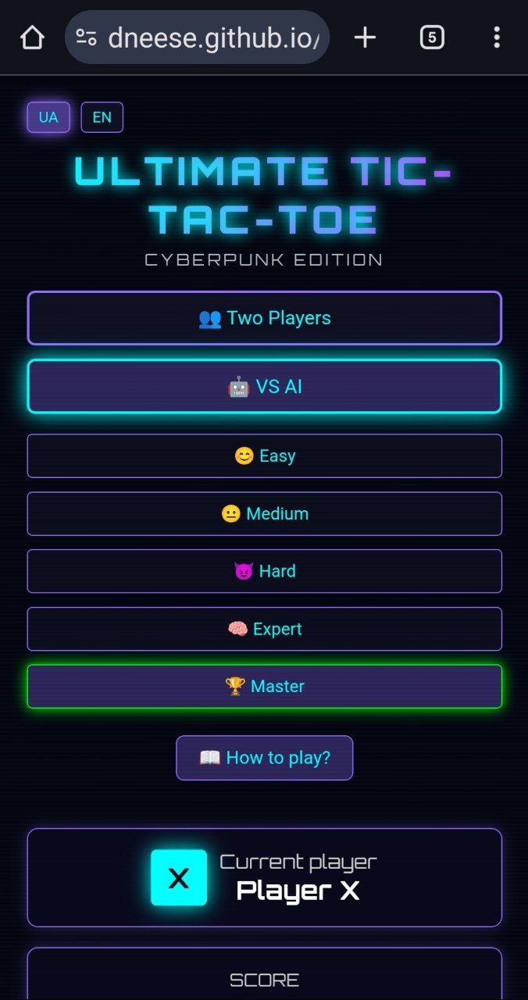

<div align="center">

# ⚛️ ULTIMATE TIC-TAC-TOE
### 🌌 CYBERPUNK EDITION 🌌

[](https://developer.mozilla.org/en-US/docs/Web/HTML)
[](https://developer.mozilla.org/en-US/docs/Web/CSS)
[](https://developer.mozilla.org/en-US/docs/Web/JavaScript)
[](LICENSE)

[](https://dneese.github.io/ULTIMATE-TIC-TAC-TOE-CYBERPUNK-EDITION/)
[](https://github.com/dneese/ULTIMATE-TIC-TAC-TOE-CYBERPUNK-EDITION/stargazers)
[](https://github.com/dneese/ULTIMATE-TIC-TAC-TOE-CYBERPUNK-EDITION/network)

**A futuristic, neon-styled implementation of Ultimate Tic-Tac-Toe**  
*Футуристична реалізація Ultimate Tic-Tac-Toe у неоновому стилі*

[English](#english) | [Українська](#ukrainian)

---




</div>

---

<a name="english"></a>

## 🇬🇧 ENGLISH

### 🎮 What is Ultimate Tic-Tac-Toe?

Ultimate Tic-Tac-Toe is a **strategic variant** of the classic game where:
- You play on a **3×3 grid of tic-tac-toe boards** (9 small boards)
- Your move determines **where your opponent must play next**
- Win **three small boards in a row** to win the game!

> 🧠 **10x more strategic** than regular tic-tac-toe — Every move matters!

### ✨ Features

<table>
<tr>
<td width="50%">

#### 🎨 **Cyberpunk Aesthetic**
- Neon glow effects
- Retro-futuristic design
- CRT scanline animations
- Dynamic board highlighting

</td>
<td width="50%">

#### 🌍 **Bilingual Support**
- Full English/Ukrainian UI
- Instant language switching
- Localized tutorial
- Persistent language preference

</td>
</tr>
<tr>
<td width="50%">

#### 🎵 **Audio Feedback**
- Move confirmation sounds
- Board win notifications
- Victory fanfare
- Web Audio API powered

</td>
<td width="50%">

#### 📱 **Responsive Design**
- Desktop optimized
- Mobile friendly
- Touch controls
- Adaptive layouts

</td>
</tr>
</table>

### 🎯 How to Play

```
┌─────────────────────────────────────────┐
│  🎯 OBJECTIVE: Win 3 small boards      │
│     in a row (↔️ ↕️ ↗️)                 │
└─────────────────────────────────────────┘
```

**The Key Rule:** Your move position sends your opponent to a specific board!

**Example:**
```
You play in: Top-Right corner of any board
Next player: MUST play in Top-Right board (unless won/tied)
```

**Special Cases:**
- **First Move:** Any board, any cell
- **Sent to Won/Tied Board:** Choose any available board
- **Tied Small Board:** Marked gray, counts for nobody

### 🚀 Quick Start

#### Play Online
👉 **[Launch Game](https://dneese.github.io/ULTIMATE-TIC-TAC-TOE-CYBERPUNK-EDITION/)** 👈

#### Run Locally
```bash
# Clone the repository
git clone https://github.com/dneese/ULTIMATE-TIC-TAC-TOE-CYBERPUNK-EDITION.git

# Navigate to the directory
cd ULTIMATE-TIC-TAC-TOE-CYBERPUNK-EDITION

# Open in browser
open index.html
# or
start index.html
```

### 🛠️ Tech Stack

| Technology | Purpose |
|------------|---------|
| **HTML5** | Structure & Semantics |
| **CSS3** | Styling & Animations |
| **Vanilla JavaScript** | Game Logic & Interactivity |
| **Web Audio API** | Sound Effects |
| **CSS Custom Properties** | Theme System |
| **ES6 Classes** | Code Organization |

### 📁 Project Structure

```
ULTIMATE-TIC-TAC-TOE-CYBERPUNK-EDITION/
├── index.html          # Main game file (all-in-one)
├── README.md           # This file
├── LICENSE             # MIT License
└── assets/            
    └── images/         # Screenshots (if any)
```

### 🎨 Color Palette

```css
--neon-cyan:    #0ff    /* Player X */
--neon-pink:    #f0f    /* Player O */
--neon-purple:  #906cff /* UI Elements */
--neon-green:   #0f0    /* Scores & Wins */
--neon-yellow:  #ff0    /* Active Board Highlight */
--dark-bg:      #0a0a16 /* Background */
```

### 🤝 Contributing

Contributions are welcome! Here's how you can help:

1. **🐛 Report Bugs** - [Open an issue](https://github.com/dneese/ULTIMATE-TIC-TAC-TOE-CYBERPUNK-EDITION/issues)
2. **💡 Suggest Features** - Share your ideas
3. **🔧 Submit PRs** - Improve the code
4. **⭐ Star the Repo** - Show your support!

#### Development Guidelines
```bash
# Fork the repository
# Create a feature branch
git checkout -b feature/AmazingFeature

# Commit your changes
git commit -m '✨ Add some AmazingFeature'

# Push to the branch
git push origin feature/AmazingFeature

# Open a Pull Request
```

### 📜 License

This project is licensed under the **MIT License** - see the [LICENSE](LICENSE) file for details.

### 🙏 Acknowledgments

- Inspired by the classic Ultimate Tic-Tac-Toe (https://github.com/dneese/cyberpunk-tic-tac-toe) strategy game
- Cyberpunk aesthetic inspired by retro-futuristic design
- Font: [Orbitron](https://fonts.google.com/specimen/Orbitron) by Google Fonts

### 📊 Stats


---

<a name="ukrainian"></a>

## 🇺🇦 УКРАЇНСЬКА

### 🎮 Що таке Ultimate Tic-Tac-Toe?

Ultimate Tic-Tac-Toe — це **стратегічний варіант** класичної гри, де:
- Ви граєте на **дошці 3×3 з хрестиків-ноликів** (9 малих дошок)
- Ваш хід визначає, **де повинен грати наступний гравець**
- Виграйте **три малі дошки поспіль**, щоб перемогти!

> 🧠 **У 10 разів стратегічніше** за звичайні хрестики-нолики — Кожен хід має значення!

### ✨ Особливості

<table>
<tr>
<td width="50%">

#### 🎨 **Кіберпанк Естетика**
- Неонові ефекти сяйва
- Ретро-футуристичний дизайн
- ЕПТ-анімації сканування
- Динамічна підсвітка дошок

</td>
<td width="50%">

#### 🌍 **Двомовна Підтримка**
- Повний англо-український UI
- Миттєве перемикання мов
- Локалізований посібник
- Збереження налаштувань мови

</td>
</tr>
<tr>
<td width="50%">

#### 🎵 **Аудіо Відгук**
- Звуки підтвердження ходів
- Сповіщення про виграш дошки
- Фанфари перемоги
- На основі Web Audio API

</td>
<td width="50%">

#### 📱 **Адаптивний Дизайн**
- Оптимізовано для десктопу
- Підтримка мобільних
- Сенсорне керування
- Адаптивні макети

</td>
</tr>
</table>

### 🎯 Як Грати

```
┌─────────────────────────────────────────┐
│  🎯 МЕТА: Виграти 3 малі дошки         │
│     поспіль (↔️ ↕️ ↗️)                  │
└─────────────────────────────────────────┘
```

**Ключове Правило:** Позиція вашого ходу визначає, куди грає суперник!

**Приклад:**
```
Ви граєте: Верхній правий кут будь-якої дошки
Наступний гравець: ПОВИНЕН грати у верхній правій дошці (якщо не виграна)
```

**Особливі Випадки:**
- **Перший Хід:** Будь-яка дошка, будь-яка клітинка
- **Відправлення на Виграну/Нічийну Дошку:** Обирайте будь-яку вільну дошку
- **Нічия на Малій Дошці:** Сіра, не рахується ніким

### 🚀 Швидкий Старт

#### Грати Онлайн
👉 **[Запустити Гру](https://dneese.github.io/ULTIMATE-TIC-TAC-TOE-CYBERPUNK-EDITION/)** 👈

#### Запуск Локально
```bash
# Клонувати репозиторій
git clone https://github.com/dneese/ULTIMATE-TIC-TAC-TOE-CYBERPUNK-EDITION.git

# Перейти до директорії
cd ULTIMATE-TIC-TAC-TOE-CYBERPUNK-EDITION

# Відкрити у браузері
open index.html
# або
start index.html
```

### 🛠️ Технології

| Технологія | Призначення |
|------------|-------------|
| **HTML5** | Структура та Семантика |
| **CSS3** | Стилізація та Анімації |
| **Vanilla JavaScript** | Ігрова Логіка |
| **Web Audio API** | Звукові Ефекти |
| **CSS Custom Properties** | Система Тем |
| **ES6 Classes** | Організація Коду |

### 📁 Структура Проєкту

```
ULTIMATE-TIC-TAC-TOE-CYBERPUNK-EDITION/
├── index.html          # Головний файл гри (все-в-одному)
├── README.md           # Цей файл
├── LICENSE             # Ліцензія MIT
└── assets/            
    └── images/         # Скріншоти (якщо є)
```

### 🎨 Кольорова Палітра

```css
--neon-cyan:    #0ff    /* Гравець X */
--neon-pink:    #f0f    /* Гравець O */
--neon-purple:  #906cff /* Елементи UI */
--neon-green:   #0f0    /* Рахунок і Перемоги */
--neon-yellow:  #ff0    /* Підсвітка Активної Дошки */
--dark-bg:      #0a0a16 /* Фон */
```

### 🤝 Внесок

Ваші пропозиції вітаються! Як ви можете допомогти:

1. **🐛 Повідомити про Баги** - [Відкрити issue](https://github.com/dneese/ULTIMATE-TIC-TAC-TOE-CYBERPUNK-EDITION/issues)
2. **💡 Запропонувати Функції** - Поділіться ідеями
3. **🔧 Надіслати PR** - Покращити код
4. **⭐ Поставити Зірку** - Підтримайте проєкт!

#### Рекомендації для Розробки
```bash
# Зробіть fork репозиторію
# Створіть гілку для функції
git checkout -b feature/ЧудоваФункція

# Закомітьте зміни
git commit -m '✨ Додати ЧудовуФункцію'

# Надішліть до гілки
git push origin feature/ЧудоваФункція

# Відкрийте Pull Request
```

### 📜 Ліцензія

Цей проєкт ліцензовано під **ліцензією MIT** - детальніше у файлі [LICENSE](LICENSE).

### 🙏 Подяки

- Натхненний класичною стратегічною грою Хрестики ноликі Tic-Tac-Toe (https://github.com/dneese/cyberpunk-tic-tac-toe)
- Кіберпанк естетика натхненна ретро-футуристичним дизайном
- Шрифт: [Orbitron](https://fonts.google.com/specimen/Orbitron) від Google Fonts

### 📊 Статистика


---

<div align="center">

### 🌟 Support the Project | Підтримайте Проєкт

If you like this project, give it a ⭐️!  
*Якщо вам сподобався цей проєкт, поставте ⭐️!*

[](https://github.com/dneese/ULTIMATE-TIC-TAC-TOE-CYBERPUNK-EDITION/stargazers)

---

**Made with 💙💛 for the Cyber-World**  
*Створено з 💙💛 для Кібер-Світу*

[🏠 Back to Top](#-ultimate-tic-tac-toe)

</div>
